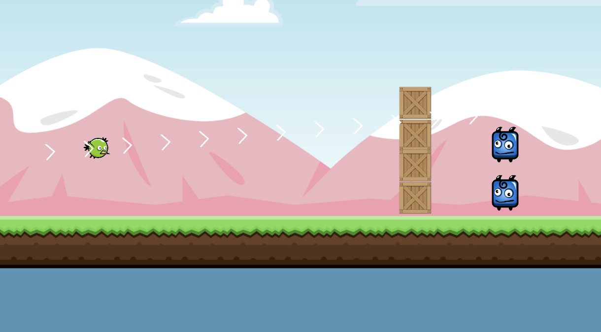
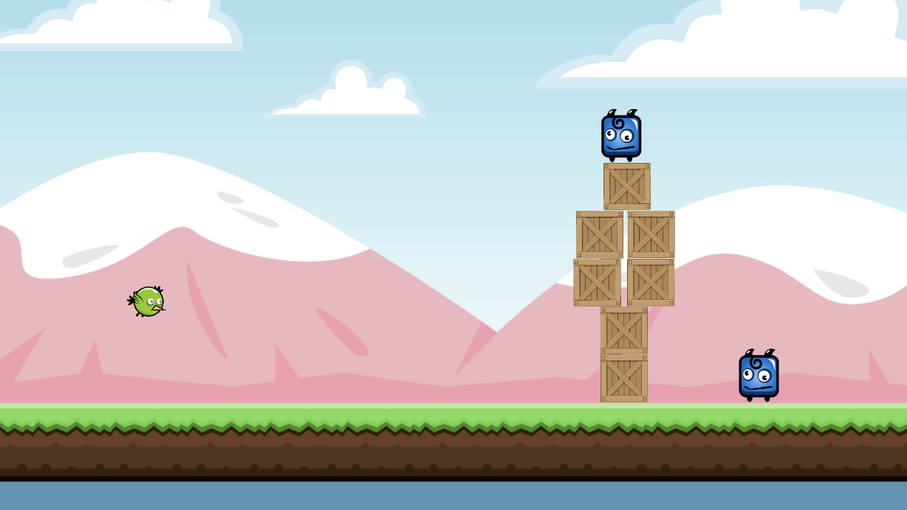
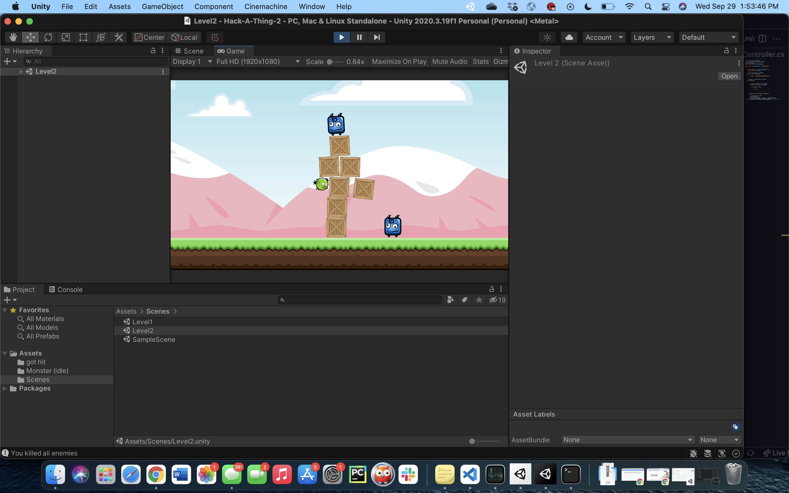
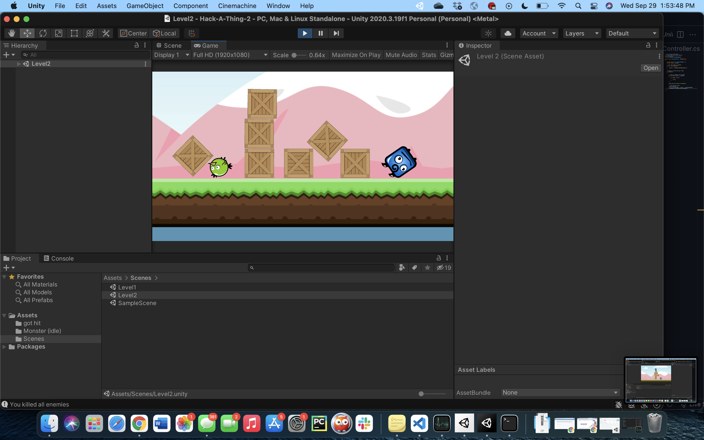

# Angry Birds-like game with Unity and C#

## What you built? 

I used unity and C# to build a simple game that functions almost exactly like Angry Birds (the player controls a bird that they pull back and then release to launch at crates and groups of enemies). It has a level controller that goes to the next level after all the enemies are successfully killed, allowing expansion for more levels (and bird/monster types).

Level 1

Level 2

Level 2 with bird in action

Level 2 aftermath with camera zoom change

## Who Did What?

I worked alone, so every part of this project was completed by myself (I followed a tutorial, so not all the code is mine)

## What you learned

Primarily, I learned a good deal about the ins and outs of Unity (materials, collisions, physics, etc.). After completing this project, I realized how much more approachable game development (and Unity in particular) is than I had previously thought. Additionally, I learned a bit about C#, a language I have not had any experience with prior to this Hack-A-Thing. While syntactically, C# didn't seem like anything new to me (at least not for the purposes I used it), it was very helpful to learn about the interaction and protocols between code files and the actual unity workspace, and how certain elements of games are addressed differently (physics and collisions, event handling, etc).

## Authors

Dionysios (Gabe) Kotsonis

## Acknowledgments

I followed this tutorial I found on youtube: 
https://www.youtube.com/watch?v=OR0e-1UBEOU&ab_channel=Zenva